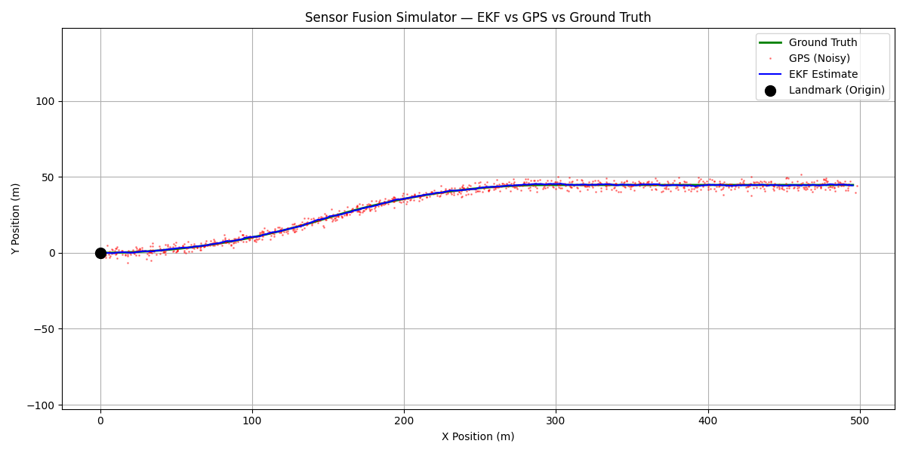
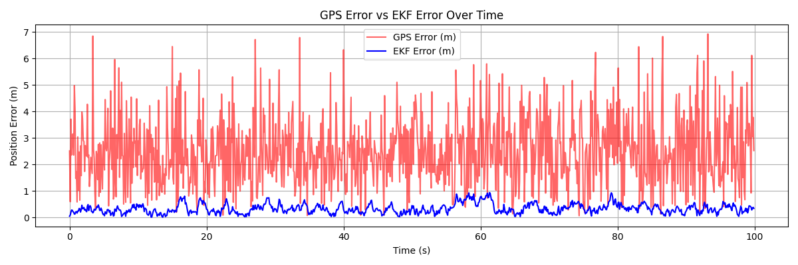

# Sensor Fusion Simulator

A 2D sensor fusion simulator implementing an Extended Kalman Filter (EKF) to track a vessel's position by fusing noisy GPS, IMU, and range sensor data.

Built as Phase 1 of a multi-phase project targeting autonomous systems and counter-UAS engineering roles. Subsequent phases will port the implementation to C++ with ROS 2 integration, then Rust.

## What it Demonstrates

- Extended Kalman Filter implementation from scratch (predict + update cycle)
- Multi-sensor fusion (GPS, IMU, range sensor) with realistic Gaussian noise
- Nonlinear measurement models with Jacobian linearisation (range sensor)
- ~3x position accuracy improvement over raw GPS across the full trajectory

## Results

| Metric | Value |
|---|---|
| Final GPS Error | ~0.95m |
| Final EKF Error | ~0.29m |
| GPS peak error | ~8m |
| EKF peak error | ~1m |




## Project Structure
```
sensor-fusion-sim/
├── docs/
│   ├── trajectory.png
│   └── error_plot.png
├── src/
│   ├── ekf.py              # Extended Kalman Filter
│   ├── sensors.py          # GPS, IMU, and range sensor simulation
│   ├── visualiser.py       # Matplotlib plotting
│   └── world.py            # Vessel motion model and simulation world
├── tests/
├── .gitignore
├── LICENSE
├── main.py
├── README.md
└── requirements.txt
```

## Setup
```bash
cd sensor-fusion-sim
python -m venv .venv
.venv\Scripts\activate      # Windows
source .venv/bin/activate   # Linux/macOS
pip install -r requirements.txt
python main.py
```

## Tech Stack

- Python 3.11, NumPy, Matplotlib
- C++ / ROS 2 (Phase 2 — upcoming)
- Rust (Phase 3 — upcoming)

## Roadmap

- [x] Phase 1 — Python EKF simulator
- [ ] Phase 2 — C++ port with ROS 2 nodes
- [ ] Phase 3 — Rust port